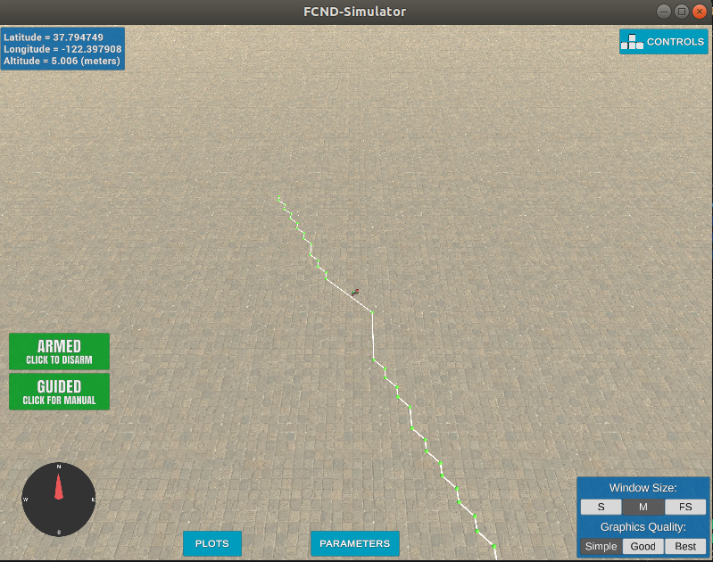
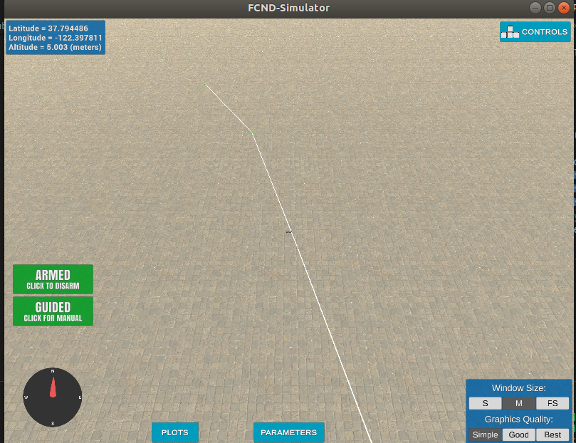

## Project: 3D Motion Planning

---
3D motion planning techniques to plan and execute a mission in a complex urban environment!

# Required Steps:
1. Load the 2.5D map in the colliders.csv file describing the environment.
2. Discretize the environment into a grid or graph representation.
3. Define the start and goal locations.
4. Perform a search using A* or other search algorithm.
5. Use a collinearity test or ray tracing method (like Bresenham) to remove unnecessary waypoints.
6. Return waypoints in local ECEF coordinates (format for `self.all_waypoints` is [N, E, altitude, heading], where the drone’s start location corresponds to [0, 0, 0, 0].
7. Write it up.
8. Congratulations!  Your Done!

#### 1. Explain the functionality of what's provided in `motion_planning.py` and `planning_utils.py`

The Key difference between `motion_planning.py` and `backyard_flyer.py` is the how the waypoints are generated. `backyard_flyer.py` uses a basic function called `calculate_box` to generate the waypoints it needs after the desired altitude is met. `calculate_box` returns a set of predefined waypoints for flying in a square motion. `motion_planning.py` on the other hand, generates waypoints by calling `plan_path` after drone is armed. `plan_path` reads in a grid, sets a start position and a goal position, then utilizing helper functions defined in `planning_utils`, it generates a path from start to goal position. `motion_planning.py` also includes an extra function to display the waypoints in the simulator.

### Implementing Your Path Planning Algorithm

#### 1. Set your global home position
Here students should read the first line of the csv file, extract lat0 and lon0 as floating point values and use the self.set_home_position() method to set global home. Explain briefly how you accomplished this in your code.

Using a combination of file readline and split functions i extracted the lon0 and lat0 into a dict and i used that to set the home_position
see line 123 to 131

#### 2. Set your current local position
Here as long as you successfully determine your local position relative to global home you'll be all set. Explain briefly how you accomplished this in your code.

here, i set the local_position by converting
the current the global_home position which is given as a long,lat coordinate to a local ECEF 
using the global_to_local function

#### 3. Set grid start position from local position
here we use our calculated NED coordinates to set our starting position. we subtract min north and east too make sure our position is relative to the grid.

        grid_start = (int(local_north - north_offset),int(local_east-east_offset))

#### 4. Set grid goal position from geodetic coords
Here, we provide a way to pass in any lon,lat to use as the
goal position. Then we convert to NED using the global_to_local function

        local_goal_north, local_goal_east, _ = global_to_local(self._global_goal_position, self.global_home)
        grid_goal = (int(local_goal_north - north_offset),int(local_goal_east-east_offset))

#### 5. Modify A* to include diagonal motion (or replace A* altogether)
The first step was to add in our new diagonal movements to the actions enum with the cost `np.sqrt(2)`. We can determine the x,y values by simply merging the values for each movement. eg. `NORTH = (-1, 0` + `EAST = (0, 1` = `NORTH_EAST = (-1,1,`

        NORTH_EAST = (-1,1,np.sqrt(2))
        NORTH_WEST = (-1,-1,np.sqrt(2))
        SOUTH_EAST = (1,1,np.sqrt(2))
        SOUTH_WEST = (1,-1,np.sqrt(2))

Then we update the `valid_actions` function to make sure these are valid movements in a given state

        if x-1 < 0 or y+1 > m or grid[x-1,y+1] == 1:
            valid_actions.remove(Action.NORTH_EAST)
        if x-1 < 0 or y-1 > m or grid[x-1,y-1] == 1:
            valid_actions.remove(Action.NORTH_WEST)
        if x+1 > n or y+1 > m or grid[x+1,y+1] == 1:
            valid_actions.remove(Action.SOUTH_EAST)
        if x+1 > n or y-1 < 0 or grid[x+1,y-1] == 1:
            valid_actions.remove(Action.SOUTH_WEST)

#### 6. Cull waypoints 
For this step you can use a collinearity test or ray tracing method like Bresenham   . The idea is simply to prune your path of unnecessary waypoints. Explain the code you used to accomplish this step.

First we implement collinearity to detect and remove points within a straight path.  
This works well, the downside is that for diagonal movements we end up with a short jiggered path. see image below

To fix the short angled paths in the collinearity approach, we implement Bresenham, a ray tracing method, which provides a list cells required to draw a line between 2 points. So far as those cells don't include collide with an obstacle, we can go ahead and prune any points in between the given points.

### Execute the fliImrpovementsght
#### 1. Does it work?
It works!
run with `python motion_planning.py` or with a goal lon,lat `python motion_planning.py --goal_pos=-122.399688,37.395765`

####Improvements and TODOs
* Use a graph for configuration space instead of grid ( grid seems to be computationally intensive for long distance planning)
* try a re-planner for dynamic obstacles
